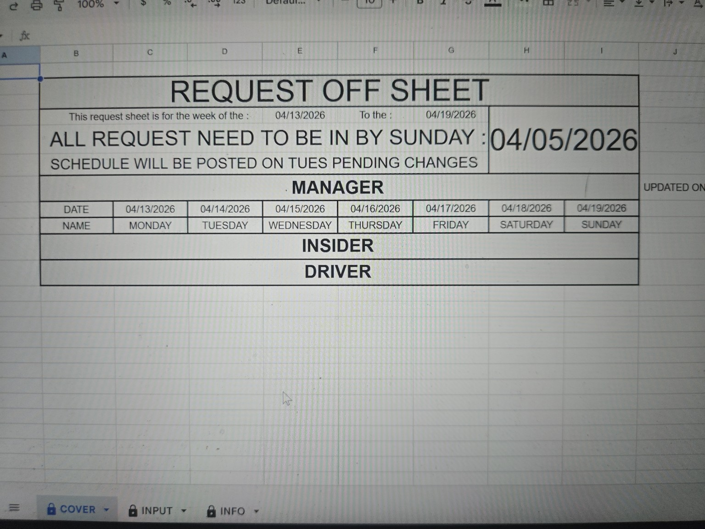
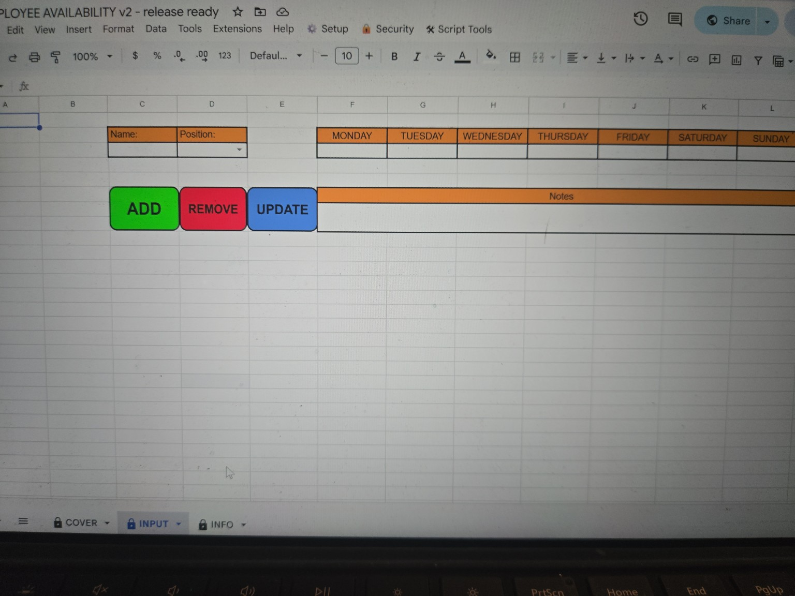
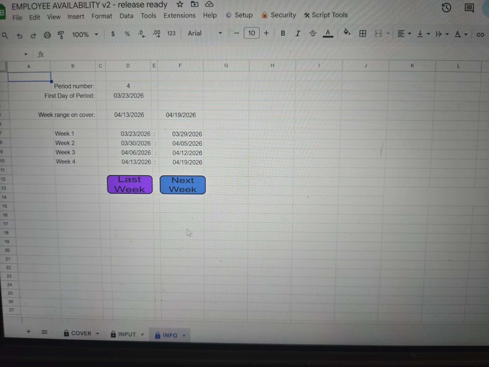
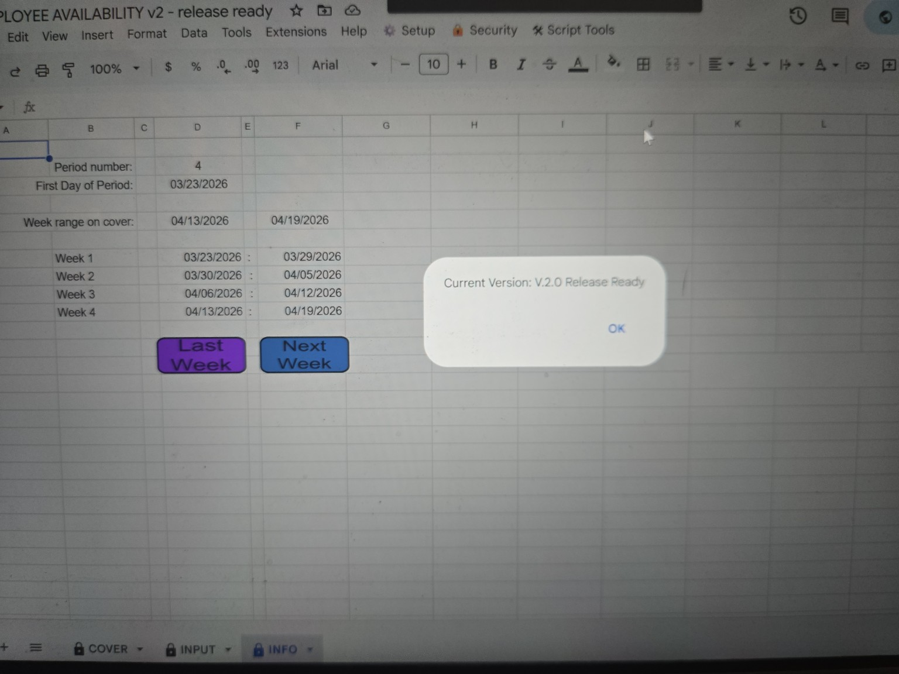

# Employee Availability System

A Google Apps Script-based system built to manage employee availability inside Google Sheets, designed for real-world store operations.

---

## 🚀 Live Demo
[Open Demo Sheet](https://docs.google.com/spreadsheets/d/1WeLuc__oP608vEdQJqHKRwasl76eo-dN89EmsR_dlEk/edit?usp=sharing)

*To test functionality: open the sheet and create your own copy.*

---

## 📌 Project Status
Current Version: **v2.0**  
Status: **Active development (internal system adapted for public showcase)**

---

## 🔧 What It Does
- Tracks employee availability across the week
- Automates dropdown validation and role selection
- Restores full sheet structure and formatting
- Supports dynamic scheduling workflows
- Includes built-in version tracking system

---

## 🛠️ Built With
- Google Apps Script
- Google Sheets

---

## 💡 Why I Built This
Managing employee availability manually is time-consuming and error-prone.

This system was built to streamline the process by automating validation, formatting, and structure—reducing mistakes and improving efficiency in day-to-day store operations.

---

## ⚙️ Key Features
- Automated sheet restoration via script
- Dynamic data validation controls
- Role-based availability handling
- Version history tracking (built-in)
- Structured weekly scheduling format

---

## 📸 Screenshots

### Cover Sheet (Request Form)

### Input Sheet (Data Entry Interface)

### Info Sheet (System Configuration)

### Version Display Popup

---

## 📜 Version History

### v2.0 — 04.13.2026
- Initial public GitHub release
- Core availability tracking system
- Automated validation and formatting
- Integrated version tracking system

---

## ⚠️ Notes
- This system depends on a specific spreadsheet structure (sheet names, ranges, and layout).
- Code is provided as a reference implementation of the system logic.
- Demo sheet is a sanitized version with no real employee or company data.

---

## 📫 Contact
Open to feedback, collaboration, and opportunities.
